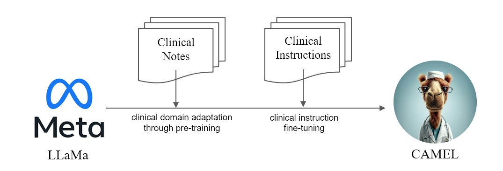

# CAMEL: Clinically Adapted Model Enhanced from LLaMA
<p align='center'>

<div align="center"><b>CAMEL</b> from Bing Image Creator</div>
</p>

[](https://opensource.org/licenses/MIT)
[](https://www.python.org/downloads/release/python-390/)
[](https://github.com/psf/black)


### [**Our Blog Post**](https://starmpcc.github.io/CAMEL)

<br/>

We present **CAMEL**, Clinically Adapted Model Enhanced from LLaMA. As LLama for its foundation, **CAMEL** is further pre-trained on MIMIC-III, MIMIC-IV, and i2b2 clinical notes and fine-tuned over clinical instructions (Figure 1). Our preliminary evaluation with GPT-4 assessment, demonstrates that **CAMEL** achieves over 96% of the quality of OpenAI's GPT-3.5 (Figure 2). In accordance with the data usage policies of our source data, both our instruction dataset and model will be published on PhysioNet with credentialized access. To facilitate replication, we will also release all code, allowing individual healthcare institutions to reproduce our model using their own clinical notes.
For futher detail, please refer our [**blog post**](https://starmpcc.github.io/CAMEL).

<p align='center'>

<div align="center">Figure 1. Performance Comparison</div>
</p>


<p align='center'>

<div align="center">Figure 2. Model Pipeline</div>
</p>

## Reproducing Guide
Due to the license issue of [MIMIC](https://mimic.mit.edu) and [i2b2](https://i2b2.org) datasets, we cannot publish the instruction dataset and checkpoints. We would publish our model and data via physionet within few weeks.

<details>
<summary>Environment Setup</summary>

```
conda create -n camel python=3.9 -y
conda activate camel
conda install pytorch torchvision torchaudio pytorch-cuda=11.8 -c pytorch -c nvidia -y
pip install pandarallel pandas jupyter numpy datasets sentencepiece openai
pip install git+https://github.com/huggingface/transformers.git@871598be552c38537bc047a409b4a6840ba1c1e4
```

</details>

<details>
<summary> Pretraining </summary>

- Note Preprocessing
  - For each note, we concatenate the category in front of the text.
  - To prevent test set leakage, we removed 404 overlapping notes from MIMIC-III with [RadQA](https://physionet.org/content/radqa/1.0.0/), [CLIP](https://github.com/asappresearch/clip), [n2c2 2018](https://pubmed.ncbi.nlm.nih.gov/31584655/) datasets for futher evaluation.
  - We concatenate all notes with `<eos>` tokens.
  - `$ python pretraining_preprocess/mimiciii_preproc.py --mimiciii_note_path {MIMICIII_NOTE_PATH} --output_path {OUTPUT_PATH}`
  - `$ python pretraining_preprocess/mimiciv_preproc.py --discharge_note_path {DISCHAGE_NOTE_PATH} --radiology_note_path {RADIOLOGY_NOTE_PATH} --output_path {OUTPUT_PATH}`
  - `$ python pretraining_preprocess/tokenize_data.py --data_path {DATA_PATH} --save_path {SAVE_PATH}`
- Run Pretriaining
  ```
  $ torchrun --nproc_per_node=8 --master_port={YOUR_PORT} \
      src/train.py \
      --model_name_or_path "decapoda-research/llama-7b-hf" \
      --data_path  {DATA_FILE} \
      --bf16 True \
      --output_dir ./checkpoints \
      --num_train_epochs 1 \
      --per_device_train_batch_size 2 \
      --per_device_eval_batch_size 2 \
      --gradient_accumulation_steps 8 \
      --evaluation_strategy "no" \
      --save_strategy "steps" \
      --save_steps 1000 \
      --learning_rate 2e-5 \
      --weight_decay 0. \
      --warmup_ratio 0.03 \
      --lr_scheduler_type "cosine" \
      --logging_steps 1 \
      --fsdp "full_shard auto_wrap" \
      --fsdp_transformer_layer_cls_to_wrap 'LlamaDecoderLayer' \
      --tf32 True \
      --model_max_length 2048 \
      --gradient_checkpointing True
  ```

</details>


<details>
<summary>Instruction Finetuning</summary>

- NOTE: To generate instructions, [you should use certified Azure Openai API](https://physionet.org/news/post/415).
- Instruction Generation

  - Set environment variables
    - `OPENAI_API_KEY`
    - `OPENAI_API_BASE`
    - `OPENAI_DEPLOYMENT_NAME`
  - Preprocess Notes
    - `$ python instructino/preprocess_note.py`
  - De-Identification instruction generation
    - `$ python instruction/de_id_gen.py --input {PREPROCESSED_NOTES} --output {OUTPUT_FILE_1} --mode inst`
    - `$ python instruction/de_id_postprocess.py --input {OUTPUT_FILE_1} --output {OUTPUT_FILE_2}`
    - `$ python instruction/de_id_gen.py --input {OUTPUT__FILE_2} --output {inst_output/OUTPUT_FILE_deid} --mode ans`
  - Other tasks instruction generation
    - You can generate instructions selectively for each dataset.
    - `$ python instruction/instructtion_gen.py --input {PREPROCESSED_NOTES} --output {inst_output/OUTPUT_FILE} --source {mimiciii, mimiciv, i2b2}`
  - Merge and formatting files
    - `$ python instruction/merge_data.py --data_path {inst_output} --output {OUTPUT_FILE_FINAL}` 


- Run Instruction Finetuning

  - All of our experimente were perfomed with 8x A6000 gpus.
  - Adjust `nproc_per_node` and  `gradient accumulate step` to fit to your hardware (global batch size=128).
```
    $ torchrun --nproc_per_node=8 --master_port={YOUR_PORT} \
        src/instruction_ft.py \
        --model_name_or_path "decapoda-research/llama-7b-hf" \
        --data_path  {OUTPUT_FILE_FINAL} \
        --bf16 True \
        --output_dir ./checkpoints \
        --num_train_epochs 3 \
        --per_device_train_batch_size 2 \
        --per_device_eval_batch_size 2 \
        --gradient_accumulation_steps 8 \
        --evaluation_strategy "no" \
        --save_strategy "epoch" \
        --learning_rate 2e-5 \
        --weight_decay 0. \
        --warmup_ratio 0.03 \
        --lr_scheduler_type "cosine" \
        --logging_steps 1 \
        --fsdp "full_shard auto_wrap" \
        --fsdp_transformer_layer_cls_to_wrap 'LlamaDecoderLayer' \
        --tf32 True \
        --model_max_length 2048 \
        --gradient_checkpointing True
        --ddp_timeout 18000
```

</details>


<details>
<summary>Evaluation</summary>

- Run model on MTSamples
  ```
  CUDA_VISIBLE_DEVICES=0 python src/evaluate.py \
    --model_name {MODEL_PATH} \
    --data_path eval/mtsamples_instructions.json \
    --output_path {OUTPUT_PATH}
  ```

  - We provide the output generated by GPT-3.5, Alpaca, and CAMEL as `mtsamples_results.json` in `eval` folder. 

- Run GPT-4 for evaluation
 
  ```
  python eval/gpt4_evaluate.py --input {INPUT_PATH} --output {OUTPUT_PATH} 
  ```
</details>

## Citation
```
@misc{CAMEL,
    title = {CAMEL : Clinically Adapted Model Enhanced from LLaMA},
    author = {Sunjun Kweon and Junu Kim and Seongsu Bae and Eunbyeol Cho and Sujeong Im and Jiyoun Kim and Gyubok Lee and JongHak Moon and JeongWoo Oh and Edward Choi},
    month = {May},
    year = {2023}
    publisher = {GitHub},
    journal = {GitHub repository},
    howpublished = {\url{https://github.com/starmpcc/CAMEL}},
}
```
## Code References
- [Stanford Alpaca](https://github.com/tatsu-lab/stanford_alpaca)
- [Minimal-LLaMA](https://github.com/zphang/minimal-llama)
- [Vicuna](https://github.com/lm-sys/FastChat)
