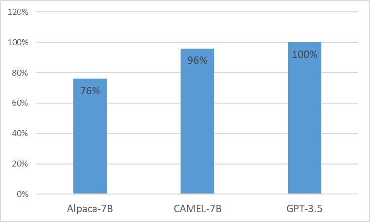
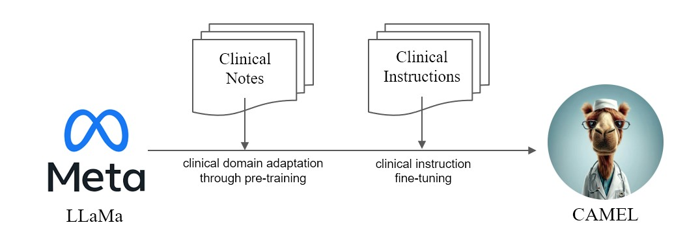
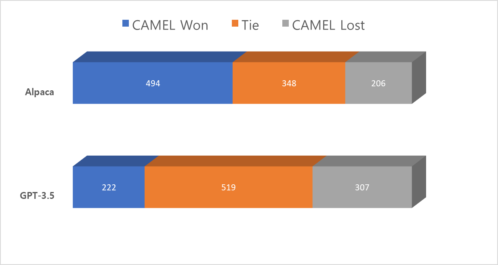

<style>

tr, th {
   border: 1px solid black;
}
</style>

<p align='center'>

<div align="center"><b>CAMEL</b> from Bing Image Creator</div>
</p>

<div class="text-center my-4">
  <a class="btn btn-lg btn-dark mx-1" href="https://starmpcc-camel-demo-demo-i7ajms.streamlit.app/" role="button">Demo Link</a>
    <a class="btn btn-lg btn-dark mx-1" href="https://github.com/starmpcc/CAMEL" role="button"> <i class="fab fa-github"></i> Github Link</a>

</div>

## UPDATE: New Model Announcement

We are proud to introduce **Asclepius**, a more advanced clinical large language model.
As this model was trained on synthetic clinical notes, it is publicly accessible via Huggingface. 
If you are considering using CAMEL, we highly recommend switching to Asclepius instead. For more information, please visit this [link](https://github.com/starmpcc/Asclepius).

----


We present **CAMEL**, **C**linically **A**dapted **M**odel **E**nhanced from **L**LaMA. As LLama for its foundation, **CAMEL** is further pre-trained on MIMIC-III and MIMIC-IV clinical notes, and finetuned over clinical instructions (Figure 2). Our preliminary evaluation with GPT-4 assessment, demonstrates that **CAMEL** achieves over 96% of the quality of OpenAI's GPT-3.5 (Figure 1). In accordance with the data usage policies of our source data, both our instruction dataset and model will be published on PhysioNet with credentialized access. To facilitate replication, we will also release all code, allowing individual healthcare institutions to reproduce our model using their own clinical notes.

<p align='center'>

<div align="center">Figure 1. Relative Response Score Assessed by GPT-4</div>
</p>
<br/>

# Overview
Large language models, such as OpenAI's GPT-series, have demonstrated promising results in tackling clinical tasks, including [entity](https://arxiv.org/abs/2303.16416) [extraction](https://arxiv.org/abs/2205.12689), [de-identification](https://arxiv.org/abs/2303.11032), and [medical record summarization](https://arxiv.org/abs/2110.07356). Despite their potential, the API-based nature of these models introduces significant privacy concerns, limiting their widespread adoption in real-world healthcare settings. Healthcare professionals require a model that can support their clinical decision-making while alleviating privacy concerns.

In response to the growing demand for privacy-preserving AI solutions in healthcare, we release **CAMEL-7B**, a new clinical large language model that has been further pretrained with clinical notes (3.4B tokens) and finetuned on 100K clinical instructions over [LLaMa](https://arxiv.org/abs/2302.13971) (Figure 2). Our results show that **CAMEL-7B** can achieve similar performance (96% score measured by GPT4) to GPT-3.5 on 13 tasks over previously unseen clinical notes.

In this study, we utilized both MIMIC-III, MIMIC-IV, and i2b2 notes to pretrain the model and generate instruction-following dataset. In compliance with the usage regulations outlined by [PhysioNet](https://physionet.org/about/), both the dataset employed for model training and the resulting model weights will be uploaded to their platform for credentialized access.

<p align='center'>

<div align="center">Figure 2. Pipeline of building <b>CAMEL</b> : <b>C</b>linically <b>A</b>dapted <b>M</b>odel <b>E</b>nhanced from <b>L</b>LaMA</div>
</p>

<br/>

# Instruction Generation
In clinical domain, particularly concerning clinical notes, there exists a set of tasks that healthcare professionals frequently ask for. In this study, we introduce 13 pre-determined natural language processing (NLP) tasks specifically designed for application to clinical notes. These tasks were derived from a [survey](https://www.nature.com/articles/s41746-022-00730-6) conducted on clinical NLP tasks in the UK between 2007 and 2022, and by examining the tools employed in the [healthcare industry](https://www.johnsnowlabs.com/) for clinical practices. The following table delineates each of the 13 task types.

| Task | Task Description |
| --- | --- |
| Coreference Resolution | Connecting pronouns to corresponding entities for better context understanding |
| De-identification | Removing sensitive patient data for privacy and regulatory compliance |
| Question Answering | Retrieving specific information from notes to aid healthcare decision-making. |
| Natural Language Generation | Generating text reports based on extracted clinical note data |
| Text Summarization | Summarizing lengthy notes for quick review of key points |
| Text Classification | Categorizing notes by criteria like diseases, symptoms, or treatments |
| Temporal Information Extraction | Extracting time-related information for chronological context |
| Relation Extraction | Identifying relationships between entities in clinical notes |
| Named Entity Recognition | Classifying entities like diseases, medications, and procedures |
| Paraphrasing | Rewriting notes for improved readability and simplicity |
| Clinical Concept Normalization | Mapping terms to standardized clinical concepts |
| Keyword Extraction | Identifying keywords for indexing and information retrieval |
| Abbreviation Expansion | Expanding abbreviations for improved readability |

Drawing upon the inspiration from [Alpaca's approach](https://github.com/tatsu-lab/stanford_alpaca) to instruction generation utilizing Text-davinci-003, we adapted this methodology for the generation of clinical instructions. We constructed a dataset consisting of 9,000 clinical discharge summaries, sourced from the [MIMIC-III](https://physionet.org/content/mimiciii/1.4/), [MIMIC-IV](https://physionet.org/content/mimic-iv-note/2.2/), and [i2b2](https://www.i2b2.org/NLP/DataSets/) repositories. In adherence to the [data usage regulations](https://physionet.org/news/post/415) prescribed by Physionet, we utilized Microsoft Azure's HIPAA-compliant GPT-3.5 language model to produce a single question for each pre-defined task and corresponding answer. The final instruction dataset encompasses 100k instructions, generated at a cost of under $100 via the OpenAI API. To facilitate replication of our work by clinical institutions with their own clinical notes, we have made the requisite code accessible through the following [link](https://github.com/starmpcc/CAMEL).

<br/>

# Training

## Clinical Notes Pre-training

Recent [study](https://arxiv.org/pdf/2304.14454.pdf) has explored the enhancement of the LLaMA model by employing additional casual language model pretraining on PubMed articles with the aim of injecting biomedical knowledge into the model. Similarly, to further familiarize our model with the unique characteristics of clinical notes, such as the prevalent use of abbreviations, non-standard grammar, and unexplained jargon, further pretraining was conducted on the entire MIMIC-III (1.3 billion tokens) and MIMIC-IV (2.1 billion tokens) notes. This process took about 200 hours on eight A6000 48GB GPU. The effectiveness of clinical pretraining will be demonstrated in the evaluation results presented below.

<br/>

## Clinical Instruction Finetuning

After pretraining the model with clinical notes, we further finetune the model with instructions that the healthcare professionals might ask about. We employed the training schema devised by [Vicuna](https://lmsys.org/blog/2023-03-30-vicuna/), which builds upon Alpaca framework. This adaptation involved extending the maximum context length to 2,048 tokens, while also incorporating gradient checkpointing mechanisms to optimize memory usage. For a comprehensive understanding of the methodology, we kindly direct readers to consult the respective repositories of [Alpaca](https://github.com/tatsu-lab/stanford_alpaca) and [Vicuna](https://github.com/lm-sys/FastChat).

<br/>

# Preliminary Evaluation

For the fair evaluation of **CAMEL-7B,** we utilized [MTSamples](https://www.mtsamples.com/index.asp) (a publically available clinical note dataset designated for research and educational purposes) that had not been used during the training process. We constructed an evaluation dataset by extracting 1,000 question-answer pairs from 108 MTSamples discharge summary notes. Informed by the evaluation approach in Vicuna, we asked GPT-4 to rate the responses of models (Alpaca, **CAMEL**, and GPT-3.5) on a scale of 1 to 10, based on the relevance and accuracy of their responses (which costs less than 50$).  Additionally, we present GPT-4's responses for ease of comparison (refer to the three examples provided below). 


## Examples

---

### Named Entity Recognition

<details>
<summary>Clinical Note</summary>

<code>
ADMITTING DIAGNOSES,1. Prematurity.,2. Appropriate for gestational age.,3. Maternal group B streptococcus positive culture.,DISCHARGE DIAGNOSES,1. Prematurity, 34 weeks' gestation, now 5 days old.,2. Group B streptococcus exposure, but no sepsis.,3. Physiologic jaundice.,4. Feeding problem.,HISTORY OF ILLNESS: ,This is a 4-pound female infant born to a 26-year-old gravida 1, now para 1-0-0-1 lady with an EDC of November 19, 2003. Group B streptococcus culture was positive on September 29, 2003, and betamethasone was given 1 dose prior to delivery. Mother also received 1 dose of penicillin approximately 1-1/2 hours prior to delivery. The infant delivered vaginally, had a double nuchal cord and required CPAP and free flow oxygen. Her Apgars were 8 at 1 minute and 9 at 5 minutes. At the end of delivery, it was noted there was a partial placental abruptio.,HOSPITAL COURSE: ,The infant has had a basically uncomplicated hospital course. She did not require oxygen. She did have antibiotics, ampicillin and gentamicin for approximately 48 hours to cover for possible group B streptococcus. The culture was negative and the antibiotics were stopped at 48 hours.,The infant was noted to have physiologic jaundice and her highest bilirubin was 7.1. She was treated for approximately 24 hours with phototherapy and the bilirubin on October 15, 2003 was 3.4.,FEEDING: , The infant has had some difficulty with feeding, but at the time of discharge, she is taking approximately 30 mL every feeding and is taking Formula or breast milk, that is, ___ 24 calories per ounce.,PHYSICAL EXAMINATION:, ,VITAL SIGNS: At discharge, reveals a well-developed infant whose temperature is 98.3, pulse 156, respirations 35, her weight is 1779 g (1% below her birthweight).,HEENT: Head is normocephalic. Eyes are without conjunctival injection. Red reflex is elicited bilaterally. TMs not well visualized. Nose and throat are patent without palatal defect.,NECK: Supple without clavicular fracture.,LUNGS: Clear to auscultation.,HEART: Regular rate without murmur, click or gallop present.,EXTREMITIES: Pulses are 2/4 for brachial and femoral. Extremities without evidence of hip defects.,ABDOMEN: Soft, bowel sounds present. No masses or organomegaly.,GENITALIA: Normal female, but the clitoris is not covered by the labia majora.,NEUROLOGICAL: The infant has good Moro, grasp, and suck reflexes.,INSTRUCTIONS FOR CONTINUING CARE,The infant will be discharged home. She will have home health visits one time per week for 3 weeks, and she will be seen in followup at San Juan Pediatrics the week of October 20, 2003. She is to continue feeding with either breast milk or Formula, that is, ___ to 24 calories per ounce.,CONDITION: , Her condition at discharge is good.
</code>

</details>
   
**Instruction** : Identify all the medications mentioned in the summary.

> **Alpaca (Assistant 1) (6/10) :** The medications mentioned in the summary are ampicillin, gentamicin, and phototherapy.

> **CAMEL (Assistant 2) (10/10)** : The medications mentioned in the summary are betamethasone, penicillin, ampicillin, and gentamicin.

> **GPT-4’s Answer** : Betamethasone, Penicillin, Ampicillin, Gentamicin

- Alpaca did not detect Betamethasone while **CAMEL** did
- Phototheray is a type of treatment

<br/>

### Natural Language Generation
<details> <summary>Clinical Note</summary>

<code>

ADMISSION DIAGNOSES:,1. Severe menometrorrhagia unresponsive to medical therapy.,2. Severe anemia.,3. Symptomatic fibroid uterus.,DISCHARGE DIAGNOSES:,1. Severe menometrorrhagia unresponsive to medical therapy.,2. Severe anemia.,3. Symptomatic fibroid uterus.,4. Extensive adenomyosis by pathological report.,OPERATION PERFORMED: , On 6/10/2009 total abdominal hysterectomy (TAH).,COMPLICATIONS:, None.,BLOOD TRANSFUSIONS: , None.,INFECTIONS: , None.,SIGNIFICANT LAB AND X-RAY: , On admission hemoglobin and hematocrit was 10.5 and 32.8 respectively. On discharge, hemoglobin and hematocrit 7.9 and 25.2.,HOSPITAL COURSE AND TREATMENT: ,The patient was admitted to the surgical suite and taken to the operating room on 6/10/2009 where a total abdominal hysterectomy (TAH) with low intraoperative complication was performed. The patient tolerated all procedures well. On the 1st postoperative day, the patient was afebrile and all vital signs were stable. On the 3rd postoperative day, the patient was ambulating with difficulty and tolerating clear liquid diet. On the 4th postoperative day, the patient was complaining of pain in her back and abdomen as well as incisional wound tenderness. On the 5th postoperative day, the patient was afebrile. Vital signs were stable. The patient was tolerating a diet and ambulating without difficulty. The patient was desirous of going home. The patient denied any abdominal pain or flank pain. The patient had minimal incisional wound tenderness. The patient was desirous of going home and was discharged home.,DISCHARGE CONDITION: , Stable.,DISCHARGE INSTRUCTIONS:, Regular diet, bedrest x1 week with slow return to normal activity over the ensuing 4 to 6 weeks, pelvic rest for 6 weeks. Motrin 600 mg tablets 1 tablet p.o. q.8h. p.r.n. pain, Colace 100 mg tablets 1 tablet p.o. daily p.r.n. constipation and ferrous sulfate 60 mg tablets 1 tablet p.o. daily, and multiple vitamin 1 tablet p.o. daily. The patient is to return on Wednesday 6/17/2009 for removal of staples. The patient was given a full explanation of her clinical condition. The patient was given full and complete postoperative and discharge instructions. All her questions were answered.
</code>

</details>


**Instruction** : Can you generate a recommendation for the patient's postoperative care?

> **Alpaca (Assistant 1) (7/10)** : The patient should be instructed to follow up with her primary care physician for any ongoing medical concerns and to have her staples removed on 6/17/2009. She should also be advised to continue taking her medications as prescribed, including Motrin 600 mg tablets 1 tablet p.o. q.8h. p.r.n. pain, Colace 100 mg tablets 1 tablet p.o. daily p.r.n. constipation and ferrous sulfate 60 mg tablets 1 tablet p.o. daily, and multiple vitamin 1 tablet p.o. daily.

> **CAMEL (Assistant 2) (9/10)** : After the patient's total abdominal hysterectomy (TAH), it is recommended that she follows regular diet, takes bedrest for one week with slow return to normal activity over the ensuing 4 to 6 weeks, and maintains pelvic rest for 6 weeks. Additionally, she should take Motrin 600 mg tablets 1 tablet p.o. q.8h. p.r.n. pain, Colace 100 mg tablets 1 tablet p.o. daily p.r.n. constipation, and ferrous sulfate 60 mg tablets 1 tablet p.o. daily, and multiple vitamin 1 tablet p.o. daily. The patient should also return on Wednesday 6/17/2009 for removal of staples.

> **GPT-4’s Comment** : Assistant 2's response was more accurate and complete, and closely reflected the information given in the clinical note while Assistant 1’s answer was similar but slightly less detailed 

<br/>

### Question Answering
<details>
<summary>Clinical Note</summary>

<code>
        
PROCEDURES:, Cystourethroscopy and transurethral resection of prostate.,COMPLICATIONS:, None.,ADMITTING DIAGNOSIS:, Difficulty voiding.,HISTORY:, This 67-year old Hispanic male patient was admitted because of enlarged prostate and symptoms of bladder neck obstruction. Physical examination revealed normal heart and lungs. Abdomen was negative for abnormal findings. ,LABORATORY DATA:, BUN 19 and creatinine 1.1. Blood group was A, Rh positive, Hemoglobin 13, Hematocrit 32.1, Prothrombin time 12.6 seconds, PTT 37.1. Discharge hemoglobin 11.4, and hematocrit 33.3. Chest x-ray calcified old granulomatous disease, otherwise normal. EKG was normal. ,COURSE IN THE HOSPITAL:, The patient had a cysto and TUR of the prostate. Postoperative course was uncomplicated. The pathology report is pending at the time of dictation. He is being discharged in satisfactory condition with a good urinary stream, minimal hematuria, and on Bactrim DS one a day for ten days with a standard postprostatic surgery instruction sheet. ,DISCHARGE DIAGNOSIS: , Enlarged prostate with benign bladder neck obstruction. ,To be followed in my office in one week and by Dr. ABC next available as an outpatient.
</code>

</details>    
    
**Instruction** : Was there any abnormal finding in the patient's abdomen on physical examination?

> **Alpaca (Assistant 1)  (2/10)** : Yes, there was an abnormal finding in the patient's abdomen on physical examination, which was a calcified old granulomatous disease.

> **CAMEL (Assistant 2)  (10/10)** : No, there were no abnormal findings in the patient's abdomen on physical examination.

> **GPT-4’s Answer** : No, there were no abnormal findings in the patient's abdomen on physical examination.

<br/>

## **CAMEL** v.s. GPT-3.5 v.s. Alpaca

<p align='center'>

<div align="center">Figure 3. Response Comparison Assessed by GPT-4</div>
</p>


|  | Alpaca | CAMEL | GPT-3.5 |
| :---: | :---: | :---: | :---: |
| Avg. Score by GPT-4 | 5.40 | 6.75 | 7.05 |

As shown in Figure 3, in 80% of the cases, **CAMEL** demonstrated similar or superior performance compared to Alpaca. In perspective of average scores, Alpaca exhibited 76% of GPT-3.5's performance, whereas **CAMEL** achieved 96%.

<br/>

# Ablation Study

|  | CAMEL | CAMEL w/o note pretraining |
| :---: | :---: | :---: |
| Avg. Score by GPT-4 | 6.75 | 6.71 |

## Is clinical note pretraining needed?

To validate the efficacy of clinical note pretraining, we compare **CAMEL** (note pretrained + instruction finetuned over LLaMA) to **CAMEL without note pretraining** (only instruction finetuned over LLaMA).  As in the table above, we can observe that the score decreased without clinical note pretraining. However, the difference is not substantial, and we believe that the clinical notes from the MTSample notes are written with plain languages compared to MIMIC notes.

<br/>

# Future work

1. Of the various types of clinical notes, such as nursing notes, physician notes, and radiology notes, only discharge summaries were employed in our work. We plan to expand the scope of the data in the near future.
2. We plan to upscale the model size using LLaMa-13B and beyond. 
3. Beyond GPT4 evaluation, a more refined evaluation of the model will be conducted by getting feedback from actual medical professionals.
4. As this [study](https://github.com/Instruction-Tuning-with-GPT-4/GPT-4-LLM) demonstrated that the enhanced performance was observed when finetuning with answers provided by GPT-4, we intend to conduct a similar experiment employing a HIPAA-certified GPT-4 model.
5. Rather than merely engaging in a question-and-answer format with the model, our research aims to expand its capabilities by enabling dialog with the model.

<br/>

# Limitations

We plan to update limitations and license after uploading the model on physionet.

<br/>

# Team

## Authors

Sunjun Kweon\*, Junu Kim\*, Seongsu Bae\*\*, Eunbyeol Cho\*\*, Sujeong Im\*\*, Jiyoun Kim\*\*, Gyubok Lee\*\*, JongHak Moon\*\* and JeongWoo Oh\*\*

\* equal contribute\\
\*\* alphabetical order

## Advisor

Edward Choi

<br/>

# Citation

```
@misc{CAMEL,
    title = {CAMEL : Clinically Adapted Model Enhanced from LLaMA},
    author = {Sunjun Kweon and Junu Kim and Seongsu Bae and Eunbyeol Cho and Sujeong Im and Jiyoun Kim and Gyubok Lee and JongHak Moon and JeongWoo Oh and Edward Choi},
    month = {May},
    year = {2023}
    publisher = {GitHub},
    journal = {GitHub repository},
    howpublished = {\url{https://github.com/starmpcc/CAMEL}},
}
```
